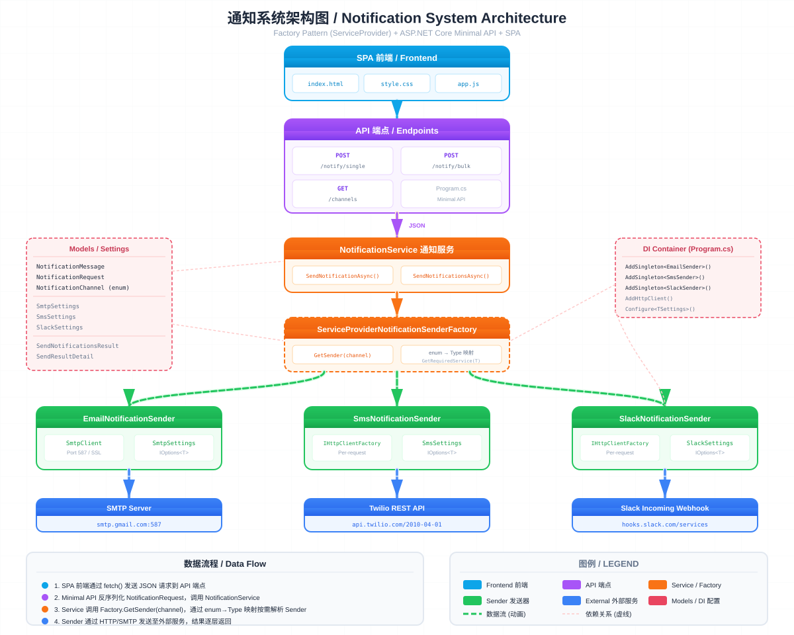

# FactoryPatternRefactor / 工厂模式重构 - 通知系统

A .NET 10 ASP.NET Core Minimal API demonstrating the **Factory Pattern** for multi-channel notification dispatch, with a browser-based SPA frontend.

基于 .NET 10 ASP.NET Core Minimal API 的多渠道通知系统，演示**工厂模式**的实际应用，附带浏览器 SPA 前端。



## Tech Stack / 技术栈

- .NET 10 / ASP.NET Core Minimal API
- C# 12+ (primary constructors, records)
- Scalar API Documentation (OpenAPI)
- Vanilla HTML + CSS + JS (SPA frontend)

## Architecture / 架构

```
SPA Frontend → API Endpoints → NotificationService → ServiceProviderNotificationSenderFactory
                                                                          │
                                          ┌───────────────┬───────────────┼───────────────┐
                                          ↓               ↓               ↓               ↓
                                   EmailSender      SmsSender      SlackSender     TeamsSender
                                          ↓               ↓               ↓               ↓
                                   SMTP Server     Twilio API    Slack Webhook   Teams Webhook
```

### Module Table / 模块说明

| Module | Path | Responsibility |
|--------|------|----------------|
| **Models** | `Models/` | NotificationMessage, NotificationRequest, NotificationChannel enum, Settings, Results |
| **Interfaces** | `Interfaces/` | INotificationSender, INotificationSenderFactory |
| **Senders** | `Senders/` | Email (SmtpClient), SMS (Twilio REST), Slack (Webhook), Teams (Webhook + Adaptive Card) |
| **Factory** | `Factories/` | ServiceProviderNotificationSenderFactory (active), DictionaryNotificationSenderFactory (alternative) |
| **Service** | `Services/` | NotificationService — single & bulk send orchestration |
| **API** | `Program.cs` | Minimal API endpoints + DI registration |
| **Frontend** | `wwwroot/` | SPA (index.html, style.css, app.js) |

### Data Flow / 数据流程

1. SPA 前端通过 `fetch()` 发送 JSON 请求到 API 端点
2. Minimal API 反序列化 `NotificationRequest`，调用 `NotificationService`
3. Service 调用 `Factory.GetSender(channel)`，通过 Keyed Services 按 enum 解析 Sender
4. Sender 通过 HTTP/SMTP 发送至外部服务，结果逐层返回

### Factory Pattern / 工厂模式

项目提供两种工厂实现（互斥使用）：

| Factory | 解析方式 | 新增渠道 |
|---------|---------|---------|
| **ServiceProviderNotificationSenderFactory** (active) | .NET 8+ Keyed Services (`GetRequiredKeyedService`) | 只需 `AddKeyedSingleton` 注册 |
| **DictionaryNotificationSenderFactory** (alternative) | `IEnumerable<INotificationSender>` 自动发现 | 只需非 Keyed 注册 `INotificationSender` |

## Quick Start / 快速开始

```bash
# Build
dotnet build

# Run (http://localhost:5163)
dotnet run --project FactoryPatternRefactor

# Watch (auto-reload)
dotnet watch --project FactoryPatternRefactor
```

- Frontend: `http://localhost:5163/`
- API Docs: `http://localhost:5163/scalar/v1`

## API Endpoints

### GET /channels

List available notification channels.

```json
{
  "availableChannels": ["Email", "SMS", "Slack", "Teams"],
  "message": "To add a new channel: 1) Add enum value 2) Create sender class 3) Register in DI"
}
```

### POST /notify/single

Send a single notification.

```json
{
  "channel": "Email",
  "recipient": "user@example.com",
  "subject": "Test Subject",
  "body": "Hello from FactoryPatternRefactor!"
}
```

Response (200):
```json
{
  "status": "Sent",
  "channel": "Email",
  "recipient": "user@example.com"
}
```

### POST /notify/bulk

Send multiple notifications in parallel.

```json
[
  { "channel": "Email", "recipient": "user1@example.com", "subject": "Hi", "body": "Message 1" },
  { "channel": "SMS", "recipient": "+1234567890", "subject": "", "body": "Message 2" },
  { "channel": "Slack", "recipient": "#general", "subject": "", "body": "Message 3" },
  { "channel": "Teams", "recipient": "team-channel", "subject": "Alert", "body": "Message 4" }
]
```

Response (200):
```json
{
  "total": 4,
  "succeeded": 3,
  "failed": 1,
  "details": [
    { "channel": "Email", "recipient": "user1@example.com", "success": true, "error": null },
    { "channel": "SMS", "recipient": "+1234567890", "success": true, "error": null },
    { "channel": "Slack", "recipient": "#general", "success": true, "error": null },
    { "channel": "Teams", "recipient": "team-channel", "success": false, "error": "Teams send failed: NotFound" }
  ]
}
```

## Adding a New Channel / 新增渠道

1. Add enum value to `NotificationChannel` in `Models/NotificationMessage.cs`
2. Create sender class in `Senders/` implementing `INotificationSender` + settings POCO in `Models/Settings.cs`
3. Register in `Program.cs`: `builder.Services.AddKeyedSingleton<INotificationSender, YourSender>(NotificationChannel.YourChannel); builder.Services.Configure<YourSettings>(...)`
4. No factory code changes needed — Keyed Services auto-resolve by enum key

## Configuration / 配置

Configure credentials in `FactoryPatternRefactor/appsettings.json`:

```json
{
  "SmtpSettings": { "server": "smtp.gmail.com", "port": 587, "username": "...", "password": "...", "fromAddress": "..." },
  "SmsSettings": { "accountSid": "...", "authToken": "...", "fromNumber": "+1..." },
  "SlackSettings": { "webhookUrl": "https://hooks.slack.com/services/..." },
  "TeamsSettings": { "webhookUrl": "https://outlook.office.com/webhook/..." }
}
```
